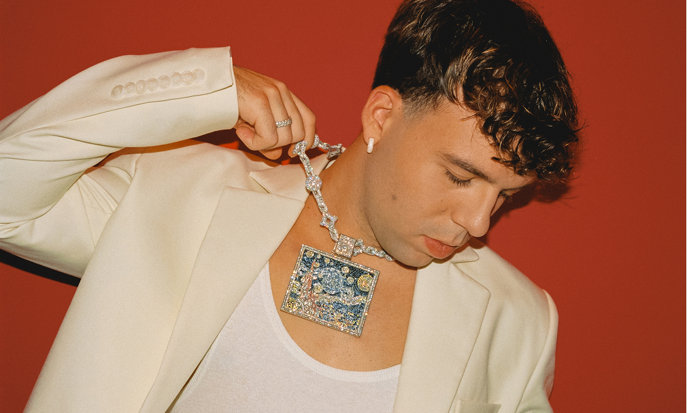

# Quevedo - Official Website

## Description

This project is the **official website of Spanish artist Quevedo**, showcasing his biography, albums, upcoming tours, and contact information. The website features a visually appealing and fully responsive design, providing an engaging user experience for fans and visitors.

The site includes hero images, album covers, tour visuals, and a footer with social media links for a complete presentation of the artist.

## Project Design Overview

## Project Structure

### Main Files

* **HTML**

  * `index.html` – Full structure of the website: hero, biography, albums, tour, contact, and footer.
* **CSS**

  * `assets/css/global.css` – Global styles and resets.
  * `assets/css/style.css` – Specific styles for hero, biography, albums, tour, and footer.
* **JavaScript**

  * `assets/js/menu.js` – Script for the interactive side menu.
* **Images**

  * `assets/img/` contains:

    * Hero: `fondo1.png`, `quevedo1.png`
    * Biography: `quevedobio1.png`, `quevedobio2.png`, `quevedobio3.png`, `quevedobio4.png`
    * Albums: `bnq.png`, `dqe.png`, `moon1.png`
    * Footer: `footer1.png`, `links icons footer.svg`
    * Icons: `arrow_forward.svg`, `arrow_forward-white.png`, `menu.svg`

---

### Main Sections

1. **Hero**

   * Background image (`fondo1.png`) and artist photo (`quevedo1.png`)
   * Main title (`h1.text-wrapper`)
   * Menu button (`.menu`) to open the side menu
   * Arrow for scrolling to the biography section (`.arrow-forward-link`)

2. **Biography**

   * Text about Quevedo’s career (`.biography-and-rise`)
   * Subsections:

     * Biography and Rise to Fame
     * Debut Album and Consolidation (2023)
     * Second Album and Redefinition (2024)
     * International Collaborations and Leadership
   * Image gallery (`.column-imagenes`) including:

     * `quevedobio1.png` – Performance
     * `quevedobio2.png` – Collage
     * `quevedobio3.png` – Performance
     * `quevedobio4.png` – Setlist

3. **Albums**

   * Albums section (`.albums`) with two main releases:

     * **Buenas Noches (2024)**

       * Cover: `bnq.png`
       * Tracklist (18 songs)
       * Spotify link
     * **Donde Quiero Estar (2023)**

       * Cover: `dqe.png`
       * Tracklist (16 songs)
       * Spotify link
   * Navigation thumbnails using `moon1.png`

4. **Tour**

   * Section `.ontour` displaying tour dates:

     * Spain, Latin America, USA, Europe
   * Each location includes dates, cities, venues, and ticket status
   * Visual layout enhanced with decorative rectangles (`.rectangle-*`)

5. **Contact**

   * Contact information via email (`info@tastethefloor.es`)
   * Embedded Google Maps location (`iframe`)
   * Layout supported by `.rectangle-6` and `.rectangle-7`

6. **Footer**

   * Logo and artist name (`footer1.png`, `.text-wrapper-10`)
   * Quick navigation links: Home, Biography, Albums, On Tour, Contact
   * Social media icons (`links icons footer.svg`)
   * Legal information: Privacy Policy, Terms of Use, Cookies
   * Copyright: `© 2025, QUEVEDO - Official Website`

---

### Features

* **Interactive Side Menu**

  * Opens with the `.menu` button, occupies 40% width of the hero and 100% height
  * Closes when clicking:

    * The logo inside the menu
    * Any link in the menu
    * Any area outside the menu (overlay)

* **Automatic Scroll**

  * The `.arrow-forward-link` smoothly scrolls to the biography section

* **Responsive Design**

  * Adapts to mobile, tablet, and desktop devices
  * Images scale with `width: 100%` and `object-fit: cover`

* **Accessibility**

  * Use of `aria-label` on buttons and important links
  * All images have descriptive alt text

## License

This project is licensed under **MIT License**.  
© 2025, QUEVEDO - Official Website. All rights reserved.

## Author

**Mario Acosta Vargas**  
*SysAdmin, DevOps & Full Stack Developer*

* 🌐 Website: [https://marioconf.vercel.app/](https://marioconf.vercel.app/) 
* ✉️ Email: [mario04asir@gmail.com](mailto:mario04asir@gmail.com)  
* 🔗 LinkedIn: [linkedin.com/in/mario-conf](https://linkedin.com/in/mario-conf)  
* 📍 Location: Granada, Spain